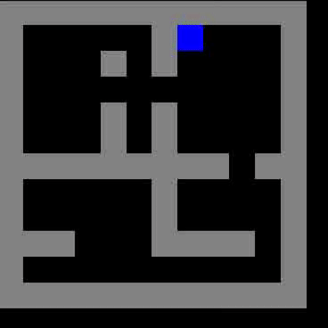
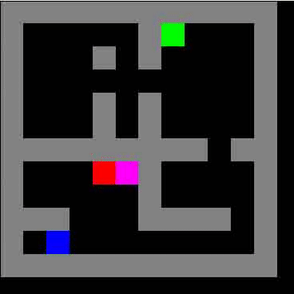
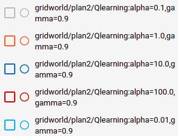
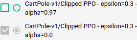
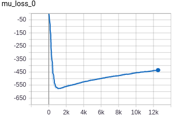
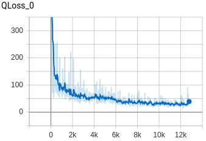

Jean-Baptiste Gaya
# 
Rapport de RLD

- [**TME 1** : Problèmes de Bandits](#TME1)
- [**TME 2** : Programmation Dynamique](#TME2)
- [**TME 3** : Q-learning](#TME3)
- [**TME 4** : DQN](#TME4)
- [**TME 5** : Policy Gradients](#TME5)
- [**TME 6** : Advanced Policy Gradients](#TME6)
- [**TME 7** : Continuous Actions](#TME7)
- [**TME 8** :  Multi-Agents RL](#TME8)
- [**TME 9** : GANs](#TME9)
- [**TME 10** : VAEs](#TME10)

__________________

# TME 1 : Problèmes de Bandits

On s'occupe ici de la mise en place de stratégies sur un problème de bandit classique : engranger le plus fort taux de clics possible en choisissant le bon annonceur à promouvoir à chaque instant t. Voici les résultats du taux de clics cumulé (vu comme des *rewards* ici) suivant les différentes stratégies adoptées :

- Stratégie Random : A chaque itération, on choisit n'importe quel annonceur
- Stratégie StaticBest : A chaque itération, on choisit l'annonceur avec le meilleur
taux de clics cumulés
- Stratégie Optimale : A chaque iteration, on choisit l'annonceur qui a le meilleur
taux de clics à cette itération
- Stratégie UCB : stratégie optimiste qui calcule la borne supérieure de l'intervalle de confiance de ce qu'on est censé attendre des différents bras par rapport aux tirages précédents. 
- Stratégie UCB-V : Même chose qu'UCB mais prise en compte de la variance pour privilégier les annonceurs au taux de clic stable.
- Stratégie LinUCB : Même chose qu'UCB mais avec prise en compte du contexte en appliquant une régression pour mieux prédire les taux de clic. 

**Conclusion** : Il est intéressant de noter que UCB-V dépasse LinUCB dans ce cas. Le contexte ne contient peut-être pas assez d'information sur les rewards pour rendre LinUCB meilleur. Au contraire, la prise en compte de la variance dans l'algorithme UCB est vraiment bénéfique. 

__________________

# TME 2 : Programmation Dynamique

Pour donner des visualisation intéressantes dans ce TME, j'ai construit une fonction qui génère le MDP d'une carte après que l'agent ait été fit. Exemple avec le plan0 de Gridworld sur **policy iteration** : 

<table><tr>
<td>  </td>
<td>  </td>
<td>  </td>
</tr></table>

à gauche : la map du jeu | au milieu : la map des values | à droite la map de la politique déterministe

On peut déjà voir l'influence du discount rate $\gamma$ : voici 3 politiques totalement différentes fittées avec policy iteration sur plan0, avec des discount rates différents. Sans surprise, plus le discount rate est proche de 1, plus l'agent sera **risk averse** :

<table><tr>
<td>  </td>
<td>  </td>
<td>  </td>
</tr></table>

à gauche : $\gamma = 0.9$ | au milieu : $\gamma = 0.95$ | à droite $\gamma = 0.99$

Sur une map bien plus grande, l'algo n'a pas de souci à trouver de politique efficace pour peu qu'on prenne soin de bien régler $\gamma$. Cela donne d'ailleurs de jolies images : 

<table><tr>
<td>  </td>
<td>  </td>
<td>  </td>
</tr></table>

plan8 de Gridworld fitté avec policy iteration et $\gamma=0.9$, convergence en 10sec environ

Cette visualisation de plan ne permet pas de regarder ceux avec des récompenses (les MDP sont alors "deux fois" plus gros et il nous faudrait regarder deux map différentes). Néanmoins on peut regarder ce que donne le parcours type d'un agent une fois entraîné, et on remarque une fois de plus à quel point $\gamma$ détermine la politique de l'agent : doit-il oui ou non chercher la reward intermédiaire ? Plus le MDP est grand, plus $\gamma$ doit être proche de 1 pour inciter l'agent à faire un détour (voir figure 2) :

<table><tr>
<td>  </td>
<td>  </td>
</tr></table>

plan2 : À gauche, $\gamma = 0.9$ | À droite, $\gamma = 0.95$  

<table><tr>
<td>  </td>
<td>  </td>
</tr></table>

plan5 : À gauche, $\gamma = 0.9$ | À droite, $\gamma = 0.99$  

L'algorithme **Value iteration** quand à lui, est bien plus rapide et permet de fit des agents sur des MDP beaucoup plus gros. On peut par exemple étudier le plan6 (sur lequel le fit est trop lent avec policy iteration) et voir l'intérêt des fonctions reward : comment faire en sorte que notre agent passe par la porte verte en bas après avoir pris la récompense intermédiaire ? L'idée est simplement de prendre un gamma assez gros et de baisser le malus associé aux cases rose (considérées comme mauvaise) :

<table><tr>
<td>  </td>
<td>  </td>
</tr></table>

plan6 : À gauche, $reward_{rose} = -1$ | À droite, $reward_{rose} = -0.2$  

**Conclusion** : **Value iteration** est bien plus rapide que **Policy iteration**. Dans ces modèles basés sur des MDP, les deux hyperparamètres fondamentaux sont $\gamma$ et la fonction reward.

__________________

# TME 3 : Q-learning

L'algorithme Q-learning donne dans l'ensemble des résultats bons et rapides sur Gridworld mais il est très difficile de tuner le modèle pour explorer de manière astucieuse le MDP et récupérer les récompenses intermédiaires. Ci-dessous on remarque que le tuning de alpha donne de bons résultats pour alpha =1 mais à peu de moments la récompense intermédiaire est prise en compte (et cela n'a rien à voir avec gamma car j'ai essayé pour gamma = 0.99)

<table><tr>
<td>  </td>
<td>  </td>
</tr></table>

Hyperparamètres communs : epsilon_decay=0.9994 

__________________

# TME 4: DQN

Il est intéressant de noter que - comme montré dans le cours - DQN dans sa forme "vanilla" donne peu de chances de réussite : il faut absolument considérer un target network et un replay buffer. Dans le graphe ci-dessous, je me suis amusé à regarder l'impact du target network sur la vitesse de convergence sur CartPole. Si l'agent converge vers des solutions sous optimales, on remarque que le fait de faire du target network lissé (i.e. à chaque update on remplace par 1-tau * sa valeur + tau * la valeur du vrai network) est mieux que de changer brutalement à 1000 ou 2000 update : 

<table><tr>
<td>  </td>
<td>  </td>
</tr></table>

Hyperparamètres communs : gamma=0.9999 | batch=100 | epsilon decay = 0.999 | layers_Q = 200 | replay-memory = 200000

Cela se ressent dans la loss du NN qui pour la smoothed value est plutôt petite, donnant tout de même les moyens à l'agent d'apprendre (pas comme la loss en gris pour C = 2000)

<table><tr>
<td>  </td>
</tr></table>

__________________

# TME 5 : Policy Gradients

L'idée était d'implémenter deux actor-critic classiques sur des problèmes jouet (cartpole et lunarlander) : **Online A2C** et **Batch A2C**. Dans leur forme la plus simple, sur `Cartpolev1` seul Batch A2C semble marcher, comme on peut le voir ici (Batch en bleu, Online en vert) :

Pour palier à cette instabilité, j'ai implémenté - comme suggéré dans le TME - des fonctions d'avantage GAE dont je rappelle la formule ici (voir cours) :
$$\hat{A}_{t}^{GAE} = \sum_{i}(\gamma\alpha)^{i}\delta_{t+i}^{V}$$

$\alpha$ est un hyperparamètre à tuner. On va regarder l'évolution des rewards durant la phase d'entrainement pour comparer ces deux méthodes, puis analyser l'impact du choix de $\alpha$ : 

<table><tr>
<td>  </td>
<td>  </td>
</tr></table>

Curieusement, c'est **la méthode Monte-Carlo** pure qui devance largement les autres méthodes. À noter qu'elle reste légèrement instable par rapport à PPO. Autre fait intéressant mais pas surprenant quand on y réfléchit : l'évolution de la loss de l'actor et de la critic sont fortement corrélées avec l'évolution des rewards cumulées. Plus la loss de l'actor est élevée, plus la distribution est piquée sur les valeurs d'avantage élevées. Pour la critique, on peut dire qu'elle est de plus en plus "optimiste" au fur et à mesure de l'entraînement car l'acteur s'améliore, fait de meilleurs choix, et a plus de chances d'avoir de grosses rewards quel que soit l'état à l'instant t : 

<table><tr>
<td>  </td>
<td>  </td>
</tr></table>

Hyperparamètres de la meilleure expé : layers_V=[200,200] | layers_f=[200,200] | alpha=1. | gamma=0.9999 | lr = 1e-4

Sur LunarLander, on constate également que la méthode Monte-Carlo marche mieux. Voici le résultat de la meilleure courbe (qui converge au bout d'environ 2k épisodes ) :

Hyperparamètres de la meilleure expé : layers_V=[300,50] | layers_f=[300,50] | alpha=1. | gamma=0.99 | lr = 1e-3

**Conclusion** : Online A2C est clairement plus instable que Batch A2C, voire impossible à tuner (dans mon cas). Le tuning de $\alpha$ laisse penser qu'une fonction d'avantage proche de Monte-Carlo a l'air de mieux fonctionner qu'un TD0 classique. Pour autant la stabilisation n'est pas évidente. PPO (voir TP suivant) est beaucoup plus stable. 

__________________

# TME 6 : Advanced Policy Gradients

On s'attaquait ici à PPO, dans une version "vanilla" tout d'abord, puis en ajoutant du clipping, et un coût entropique. Voici tout d'abord une comparaison sur Cartpole entre le PPO "vanilla" (en rose), et un ppo clippé et avec un coût entropique (bleu clair) sur CartPole :

Il apparaîssait aussi que PPO Clipped était plus facile à tuner que PPO KL. La recherche de bons paramètres est peu évidente sur un exemple comme CartPole tant la convergence est rapide. Exemple avec le tuning de $\epsilon$ ou $\alpha$ ici :

<table><tr>
<td>  </td>
<td>  </td>
</tr></table>
<table><tr>
<td>  </td>
<td>  </td>
</tr></table>

Hyperparamètres : lr=1e-3 | minibatch = 10 | epochs = 50 | update every 100 step | layers = 200 

__________________

# TME 7 : Continuous Actions

DDPG est particulièrement adapté aux actions continues. Le plus dur dans ce TME a été d'obtenir de bonnes trajectoires en jouant sur l'exploration. Si l'exploration est randomisée, on peut attendre très longtemps avant d'avoir des succès. L'idée est alors de faire une sorte d'imitation learning en utilisant un
[bruit d'Ornstein Uhlenbeck](https://en.wikipedia.org/wiki/Ornstein%E2%80%93Uhlenbeck_process). Avec cela, on obtient rapidement de bons résultats sur Mountaincar Continuous. Ci-dessous à gauche la loss de la critique qui fluctue à cause du target network mais reste stable, au milieu la loss de l'acteur qui est maximisée, à droite les rewards cumulées qui arrivent au max après un peu plus de 100 epochs :

<table><tr>
<td>  </td>
<td>  </td>
<td>  </td>
</tr></table>

Hyperparamètres : gamma=0.99 | batch=64 | update_freq=1 | max_explo= 50 | epochs=1 | start_train=1

__________________

# TME 8 :  Multi-Agents RL

Dans la continuité du TME précédent, il fallait implémenter un algorithme DDPG multi-agent. La Q-fonction de chaque agent intégrait les observations et actions des autres agents, ce qui était censé créer une coordination. J'obtiens péniblement des résultats satisfaisants sur simple_spread : 

<table><tr>
<td>  </td>
<td>  </td>
<td>  </td>
</tr></table>

Hyperparamètres : num_agents=3 | tau=0.1 | gamma=0.95,batch=1024 | update_freq=1 | max_explo=250 | epochs=1 | start_train=150

On peut voir que la loss de des acteurs se met à monter ce qui n'est pas idéal.

__________________

# TME 9 : GANs

Au bout de seulement 4 epochs sur colab, j'ai obtenu des résultats corrects, en moyenne lissée, les deux loss diminuent : 

<table><tr>
<td>  </td>
<td>  </td>
</tr></table>

Voici le résultat de la 4eme epoch en termes d'images générées aléatoirement : 

<table><tr>
<td>  </td>
</tr></table>

__________________

# TME 10 : VAEs

Une alternative connue aux GANs est les Variational Auto Encoder. Il était question d'entraîner un VAE sur la base de données MNIST puis de générer de nouveaux samples. Le reparametrization trick permettait de sampler sans se soucier du backward. On avait le choix de la taille de l'espace latent. Évidemment, plus l'espace latent est grand, meilleure est l'optimisation : 

<table><tr>
<td>  </td>
<td>  </td>
</tr></table>

Pour autant en décomposant la loss, on se rend compte que le coût KL est un peu moins bas pour l'espace latent à 2 valeurs que pour celui à 20 valeurs. Pour le coût BCE, c'est l'inverse : 

<table><tr>
<td>  </td>
<td>  </td>
</tr></table>

Ceci explique qu'on obtient tout de même de très bons résultats pour l'espace latent à deux valeurs, et on peut par exemple regarder la variation des sample générés en fonction de $x_{1}$ la première variable de l'espace latent, et $x_{2}$ la deuxième :

<table><tr>
<td>  </td>
</tr></table>

résultat du VAE à deux variables latentes. Hyperparamètres : 1000 epochs | lr=1e-3 puis 1e-5 à partir de 300 epochs | Optimiseur : Adam

**Conclusion :** il aurait été intéressant de voir comment **disentangler** l'espace latent dans le modèle à deux variables pour avoir deux variables explicatives (par exemple une variable serait le style d'écriture et l'autre serait le nombre)
